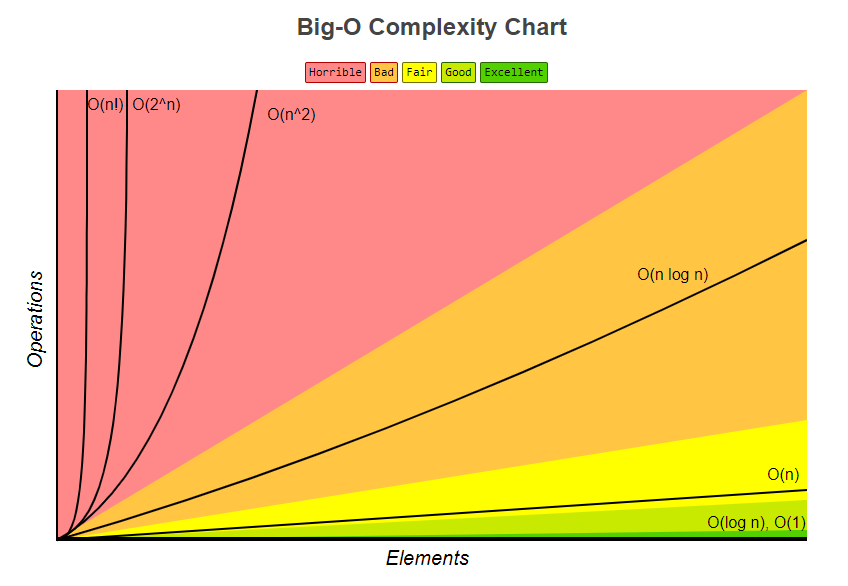

# Space and Time Complexity

## Big O Notation

- Big O Notation describes the complexity of your code using algebraic terms. 

- Used to analyse the cost of an algorithm

### Big O, Little O, Omega, Theta

- **Big O** ``O()`` describes the **upper bound** of the complexity.
- **Little O** ``o()`` describes the **upper bound excluding the exact bound** (not asymptotically tight).
- **Big Ω Omega** ``Ω()`` describes the **lower bound** of the complexity.
- **Little ω Omega** ``Ω()`` describes the **lower bound** of the complexity that is not asymptotically tight.
- **Theta** ``Θ()`` describes the **exact bound** of the complexity (a bound that is "sandwiched" between the upper and lower limits for sufficiently large values).

In formal terms:

- **Big O**: ``f(N) is O(g(N))``, iff there exists constants ``c`` and ``N₀``, such that ``f(N) ≤ cg(N)`` for all ``N > N₀``

- **Omega**: ``f(n) is Ω(g(n))``, iff there exists constants ``c`` and ``N₀``, such that ``f(N) ≥ cg(N)`` for all ``N > N₀``

- **Theta**: ``f(n) is Θ(g(n))``, iff ``f(n) is O(g(n))`` and ``f(n) is Ω(g(n))``

- **Little O**: ``f(n) is o(g(n))``, iff ``f(n) is O(g(n))`` and ``f(n) is not Θ(g(n))``

Generally when we talk about Big O, we usually mean Theta. This is because it is meaningless if you give a upper bound that is way larger than the scope of the cost analysis. We want to the know the **tight bound** of the function.

- When calculating Big O Notation, we only care about dominant terms (the term that grows the fastest), and do not care about coefficients.

### Complexity Comparison

- ``O(1)`` (Constant) has the least complexity
- ``O(log n)`` (Logarithmic) is more complex than ``O(1)``, but less complex than polynomials. This complexity is often related to divide and conquer algorithms, and a good complexity 
for sorting algorithms.
- ``O(n)`` (Linear)
- ``O(n*log n)``
- ``O(n²)`` (Quadratic)
- Higher order polynomials
- Exponential have greater complexity than polynomials if the coefficients are positive multiples of n. 
- ``O(n!)`` (Factorials) have greater complexity than exponentials

We generally take base 2 for exponentials and logarithms since things tend to be binary in CS.

## Time Complexity

- How much time it takes for the program to complete the task. 

- How the runtime of an algorithm grows as the input grows

- We use Big O Notation to describe this

- Generally when we evaluate time complexity of an algorithm, we look at their ``worst-case`` performance.

### Shorthands

- Arithmetic operations are constant
- Variable assignment is constant
- Accessing elements in an array (by index) or object (by key) is constant
- The complexity of a loop is the length * complexity of code inside loop

## Space Complexity

- How much extra memory we need to allocate in order to run the code in our algorithm

- Can also use Big O Notation to describe space complexity