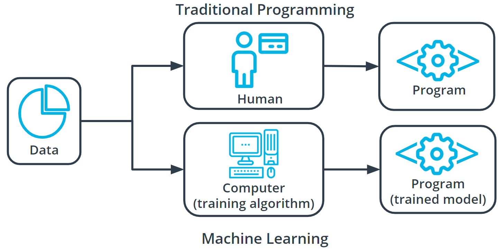

# Examples of usage of ML

- It is the engine behind the recent advancements in industries such as autonomous vehicles.
- It allows for more accurate and rapid translation of the text into hundreds of languages.
- It powers the AI assistants you might find in your home.
- It can help improve worker safety.
- It can speed up drug design.

# What is Machine Learning? 

A modern software development technique and a type of artificial intelligence (AI) that enables computers to solve problems by using examples of real world data.

It allows computers to automatically learn and improve from experience without being explicitly programmed to do so. ML is how computers learn from data to discover patterns and make predictions.

There are several types or techniques. For supervised and unsupervised learning, models inspect data to discover patterns, then humans use the patterns to gain new understanding or make predictions.

## Supervised learning

Every training sample from the dataset has a corresponding label or output value associated with it. The algorithm learns to predict labels or output values.

e.g. predict a sale value of a house, or classify an object in an image

## Unsupervised learning

There are no labels for the training data. A machine learning algorithm will try to learn the underlying patterns or distributions that govern the data.

## Reinforcement learning

Takes a difference approach to supervised and unsupervised learning.

The algorithm figures out which actions to take in a situation to maximize a reward (number) on the way to reaching a specific goal. It learns through consequences of actions in an environment.

# Traditional problem solving vs machine learning

In traditional problem solving with software, a person analyzes a problem and engineers a solution in code to solve that problem. For many real world problems, this process can be laborious or impossible, because a correct solution would need to consider a vast number of edge cases.

In ML, the problem solver abstracts away part of their solution as a flexible component called a *model*, and uses a *model training algorithm* to adjust that model to real-world data. This results in a trained model which can be used to predict outcomes that are not part of the data set used to train it.

In a way, ML automates some of the statistical reasoning and pattern-matching the problem solver would traditionally do.

# Components of Machine Learning

Nearly all tasks solved with ML involve these primary components:
- Machine Learning Model
- Model Training Algorithm
- Model Inference Algorithm

## ML Model

A block of code or framework that can be modified to solve different but related problems based on the data provided

A model is an extremely generic program(or block of code), made specific by the data used to train it. It is used to solve different problems.

A *linear regression model* describes a linear relationship between the sample and label/output. Such a model predicts that as one varible increases/decreases, so does the label/output one way or another.

## Model Training Algorithm

Model training algorithms work through an iterative process:
- Determine what changes need to be made
- Makes small changes to the model to make these results better
- Repeat

## Model Inference Algorithm

The process to use a trained model to solve a tasks e.g. generate predictions

# Machine Learning Steps

A common workflow to accomplish ML tasks:
1. Define the problem
2. Build the dataset
3. Train the model
4. Evaludate the model
5. Use the model

These steps are iterative so the process is reviewed and if things are not operating as expected, then the current or previous step will need to be revisited to try identify the breakdown.

## Define the problem

How:
- Define a very specific task
- Identify the machine learning task we might use to solve this problem
	- this helps you better understand the data you need for a project

### Machine Learning Task

All model trianing algorithms and the models themselves, take data as their input. Their outputs can be very different and are classified into a few different groups based on the task they are designed to solve.

We often use the kind of data required to train a model as part of defining a machine learning task. 

The two most common machine learning tasks are Supervised and Unsupervised Learning.

A task is *supervised* if you are using labeled data. The term *labeled* refers to data that already contains the solutions, called *labels*.

In supervised learning, there are two main identifiers in ML:
- A *categorical* label has a discrete set of possible values. When you work with categorical labels, you often carry out classification tasks.
	- Classification tasks involve predicting some unknown categorical attribute about your data.
- A *continuous* (regression) label does not have a discrete set of possible values, which often means you are working with numerical data.
	- Regression tasks involve predicting some unknown continuous attribute about your data.

A task is considered *unsupervised* if you are using *unlabeled data*. This means you don't need to provide the model with any kind of label or solution while the model is being trained.

One common unsupervised task is called **clustering**. Clustering helps determine if there are any naturally occuring groupings in the data.
e.g. Identifying book micro-genres - as we don't know which micro-genres exist (and there may be an infinite amount), we can't use supervised learning. Words and phrases used in the book description might provide some guidance on a book's micro-genre.

## Build the dataset

This step is building a dataset that can be used to solve you ML based problem. Understanding the data needed helps you select better models and algorithms so you can build more effective solutions.

This may be the most important step of the ML process and may take up most of your time.
It is also perhaps the most overlooked step.

Four aspects of working with data:

### Data collection

This can be as straightforward as running the appropriate SQL queries or as complicated as building custom web scraper apps to collect data. You may even have to run a model over your data to generate the needed labels.

Fundamental question:
*Does the data you've collected match the machine learning task and problem you have defined?*

### Data inspection

The quality of your data will directly affect how well your model will perform. When inspecting data, look for:
- Outliers
- Missing/incomplete values
- Data that needs to be tranformed or preprocessed to be in the correct format used by your model
	- e.g. Data vectorization (converting to numbers) for images

### Summary statistics

Models can assume how your data is structured.

With data in hand, it is good practice to check the data is in line with underlying assumptions of your chosen ML model. You can calcualte things like mean, inner-quartile range (IQR), and standard deviation. These can give you insight into the *scope*, *scale*, and *shape* of the dataset.

### Data visualization

Use data visualization (e.g. graphs) to see outliers and trends in your data

## Model Training

### Splitting your dataset

Before beginning training you need to randomly split your dataset:
- *Training dataset*: The data on which the model will be trained. Most of your data will be here. Many developers estimate about 80%.
- *Test dataset*: The data withheld from the model during training, which is used to test how well your model will generalize to new data

### Training a model

What does a model training algorithm actually do?

Iteratively update *model parameters* to minimize some *loss function*.

*The model training algorithm iteratively updates a model's parameters to minimize some loss function.*

- *Model parameters* - settings or configurations the training algorithm can update to change how the model behaves
- *Loss function* - Measurement of how close the model is to its goal

### Process

The end-to-end training process is:
- Feed the training data into the model.
- Compute the loss function on the results.
- Update the model parameters in a direction that reduces loss.

Cycle through these steps until a predefined stop condition is met. This ccould be based on training time, number of training cycles, or a more intelligent or application-aware mechanism.

### Advice

- How do I actually implement model training? 

Practitioners often use machine learning frameworks that already have working implementations of models and model training algorithms. You could implement these from scratch, but you probably won't need to do so unless you’re developing new models or algorithms.

- How do I determine which model to use?

Practitioners use a process called *model selection* to determine which model or models to use. The list of established models is constantly growing, and even seasoned machine learning practitioners may try many different types of models while solving a problem with machine learning.

- Training algorithm hyperparameteres

*Hyperparameters* are settings on the model which are not changed during training but can affect how quickly or how reliably the model trains, such as the number of clusters the model should identify.

- Be prepared to iterate.

### Common models

#### Linear models

Linear models simply describe the relationship between a set of input numbers and a set of output numbers through a linear function.

Classification tasks often use a strongly related logistic model, which adds an additional transformation mapping the output of the linear function to the range [0, 1], interpreted as “probability of being in the target class.”

Linear models are fast to train and give you a great baseline against which to compare more complex models.

#### Tree-based models

Tree-based models learn to categorize or regress by building an extremely large structure of nested if/else blocks, splitting the world into different regions at each if/else block. Training determines exactly where these splits happen and what value is assigned at each leaf region.

#### k-means

Common cluster-finding model. In this model, you change a model parameter `k` to be equal to how many clusters the model will try to find in your dataset.

Since your data is unlabeled, you don't know how many exist, so you train your model multiple times using different values for `k` each time.

#### Deep learning models

Extremely popular and powerful, deep learning is a modern approach based around a conceptual model of how the human brain functions. The model (also called a *neural network*) is composed of collections of *neurons* (very simple computational units) connected together by *weights* (mathematical representations of how much information to allow to flow from one neuron to the next). The process of training involves finding values for each weight.

Various neural network structures have been determined for modeling different kinds of problems or processing different kinds of data.

Examples include **FFNN**, **CNN**, **RNN/LSTM**, **Transformer**

### Using Python Libraries

For more classical models (linear, tree-based), take a look at `scikit-learn` to handle the implementation of the model training algorithm for you.

For deep learning, `mxnet`, `tensorflow`, `andpytorch` are the three most common libraries.

## Model Evaluation

After you have collected your data and trained a model, you can start to evaluate how well your model is performing. The metrics used for evaluation will likely be specific to the problem defined.

There are numerous evaluation metrics or methods available to evaluate a model, so research needs to be done to find a metric that will help evaluate your model most effectively. Here are some examples:

- Accuracy
- Confusion matrix
- F1 Score
- False positive rate
- False negative rate
- Log Loss
- Negative predictive value
- Precision
- Recall
- ROC curve
- Specificity

### Model Accuracy

- Fairy common evaluation metric
- *Accuracy* is the fraction of predictions a model gets right

### Log Loss

*Log loss* seeks to calculate how *uncertain* your model is about the predictions it is generating. In this context, uncertainty refers to how likely a model thinks the predictions being generated are to be correct.

### RMS

One of the most common evaluation metrics in a regression scenario is called the *root mean square* or *RMS*. RMS can be thought of roughly as the "average error" across your test dataset, so you want this value to be low.

You compute the RMS between your model's prediction for a data point in your test dataset and the true value from your data. You want the data points to be as close to the "average" line as possible, which would mean less net error.

### Silhouette coefficient

This metric can be used to descrive how well your data was clustered by the model. To find the optimal number of clusters, you plot the silhouette coefficient against the number used.

### Iterative process

Remember each step of the ML process is highly iterative, so it should be changed or re-scoped during the course of a project. At each step, you may need to go back and re-evaluate some assumptions you had in previous steps (might need to change configuration of parameters of the training model, make adjustments to your data, or even use a different model).

## Model Inference

Once you have trained your model, have evaluated its effectiveness, and are satisfied with the results, you're ready to generate predictions on real-world problems using unseen data in the field. In machine learning, this process is often called *inference*.

Even after you deploy your model, you're always monitoring to make sure your model is producing the kinds of results that you expect. There may be times where you reinvestigate the data, modify some of the parameters in your model training algorithm, or even change the model type used for training.