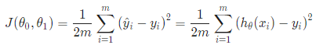
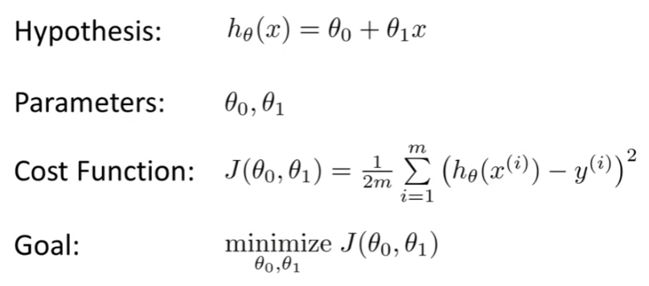
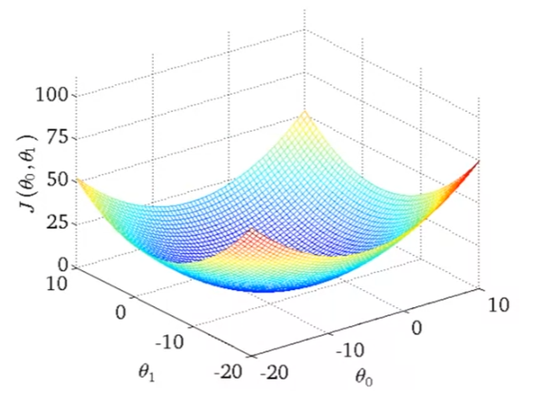
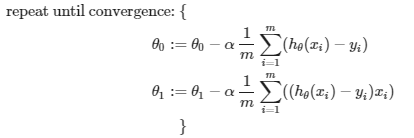

# Definition

(Arthur Samuel, 1959) Field of study that gives computer the ability to learn without begin explicitly programmed.

(Tom Mitchell, 1998) Well-posed Learning Problem: A computer program is said to learn from experience E with respenct to some task T and some performance measure P, if its perforamnce on T, as measured by P, improves with experience E.

e.g. for playing checkers:

E = the experience of playing many games of checkers

T = the task of playing checkers.

P = the probability that the program will win the next game.

# Machine Learning algorithm types

In general, any machine learning problem can be classified as one of two:
- Supervised learning
- Unsupervised learning

Some other topics are: Reinforcement learning, recommender systems

# Supervised learning

- Given a data set and know what correct output should look like, having the idea that there is a relationship between the input and output.
- Categorized into:
    - Regression problem: Predict continuous valued output (map input values to continuous function)
    - Classification problem: Predict discrete valued output (map input values into discrete categories)

# Unsupervised learning

- Allows us to approach problems with little or no idea what the results should look like
- We can derive structre from data where we don't necessarily know the effect of the variables
    - Done by clustering the data based on relationships among the variables in the data

# Model Representation

- we’ll use `x⁽ⁱ⁾` to denote the input variables (input features)
- `y⁽ⁱ⁾` to denote the output/target variables that we are trying to predict
- a pair `(x⁽ⁱ⁾, y⁽ⁱ⁾)` is called a training example, and a list of these will be donated by `m`
- Our goal is, given a training set, to learn a function `h : X -> Y` so that `h(x)` is a "good" predictor for the corresponding value of `y`. 
    - `h` is called a hypothesis.
    - An example with only one input and output variables is called Univariate linear regression (Linear regression with one variable)

# Cost Function 

- The accuracy of our hypothesis function can be measured using a cost function
- The idea is to take an average difference of all the results of the hypothesis with inputs vs the actual output
- Given a linear regression problem with hypothesis `h(x) = θ₀ + θ₁x`, the cost function is:

- This cost function, also called the "Squared error function" or "Mean squared error", is essentially half of the mean of the squares of the difference between predicted and actual value.
    - The mean is halved as a convenience for the computation of the gradient descent, as the derivative term of the square function will cancel out the 1/2.

- Our objective is to minimise the function `J(θ₀,θ₁)` to get the best possible line for `h(x)` (average squared vertical distances of the points will be the least - ideally the line will pass through all points in data set). In the best case, `J(θ₀,θ₁)` will be 0.

A 3d plot illustrating an example showing `J` for varying values of `θ₀` and `θ₁`:

## Contour plot

- A contour plot is a graph that contains many contour lines
- A contour line of a two variable function has a constant value at all points of the same line
- Example:

This below graph illustrates that the inner most 'circle' minimises the cost function as much as possible with `θ₀` and `θ₁` around 0.12 and 250 respectively.

# Gradient Descent

- We aim to find the minimum of this 3d graph. This is done by starting at a point, and taking the derivative of our cost function at that point. This gives us a direction to move towards (steepest descent).
- Repeated until the cost function has a minimal value (bottom pit of graph - red arrows).

- The gradient descent algorithm is:
    - repeat until convergence: 
    - (`:=` is assignment)
    - where j = 0, 1 represents the feature index number
    - The size of each step is determined by `α`, called the learning rate
        - if `α` is too small, gradient descent can be slow
        - if `α` is too large, it may overshoot the minimum. It may fail to converge, or even diverge.
- Depending on where one starts on the graph, one could end up at different points
- As we approach a local minimum, gradient descent will take smaller steps (derivative gets smaller)

## Gradient Descent for Linear Regression

- We can substitute our actual cost function and our actual hypothesis function and modify the equation to:

    - where `m` is the size of the training set (data)
    - `θ₀`, `θ₁` constants that will be changing simultaneously
    - `xᵢ` and `yᵢ` are values of the given training set (data)
- `xᵢ` for `θ₁` is due to the derivative
- Linear regression only has one global minimum, and no other local minimums, so gradient descent will always converge (given the learning rate is not too large).

- This method is sometimes called "Batch" Gradient Descent as we used all the training examples (sum)
