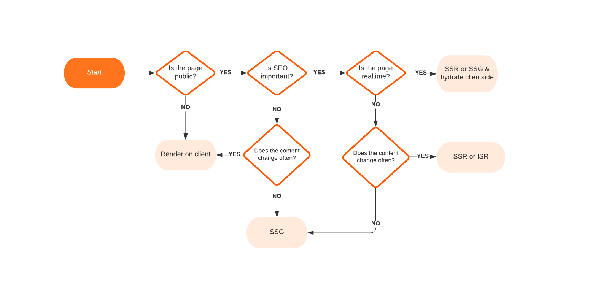

# Creating Project and Project Structure

```bash
npx create-next-app <appname>
# or to do in current directory:
npx create-next-app .
```

## /styles (default)

- css defined in `styles/globals.css` will be applied everywhere, so careful when using this to prevent style conflicts or name collisions
- use `.module.css` for specific pages

## /public (default)

- store things like images, favicons or files that are static and part of the application at all times

## /pages (default)

- defines main routes for website
	- main routing of application and components that each of the pages routes to
	- the root of the pages directly is like being on the root URL of your webpage
- the root URL will route to the `index.js` file/component
- `_app.js` wraps all pages 
	- can be thought of as main entry point for any page in the application
		- like a wrapper or layout that surrounds every other page
	- use to UI components that are available on every page, like a nav bar or footer
	- use to manage authentication state on the front end

### /api (default)

- Way to easily create a backend api to bundle JS code that won't be included in client side application

Files in here:
- only executes on the server
- will not add to JS bundle size

## /components (not included by default but good idea)

- Store reusable React UI components here
- Convention of 1 component per file e.g. `Navbar.js`

## /lib (not included by default but good idea)

- Store reusable JS libraries here, or any other code that might be used throughout the application
	- e.g. config files, helper functions, custom react hooks

# Adding TypeScript to Project

- add `tsconfig.json` file to root folder
- do `npm run dev` and it will return an error to install TypeScript and other dependencies, so do so 
	- likely `npm install --save-dev typescript @types/react @types/node`
- do `npm run dev` again, and it should automatically update your empty config file to have recommended 
- convert all your `js` files to `ts` and `tsx`
- you can now import types directly from `'next'` to strongly type your code


# defining routes

Either:
- add file with the name of the route e.g. `admin.js` or `admin.tsx`
- add a folder with a `index` file e.g. `admin/index.js` or `admin/index.tsx`
	- this approach is suitable for routes that go multiple levels deep

Dynamic routes can be created by using `[]` in the name of the file e.g. `admin/[].js`.
This also works for folders e.g. `[username]/index.js`.

Note static routes have priority over dynamic routes. E.g. if there is a `/admin` and `/[username]` route, going to `/admin` will work as expected rather than going to the users page.

## Links

```tsx
import Link from 'next/link';

...

<Link href="/jfyang">Jins profile</Link>
```

- `<Link>` acts like a regular `<a>` element
- `href` can be a string that links to that page when a child element is clicked, or a more explicit object can be defined
- a `prefetch` setting is on by default - next prefetches any links in advance to make your website more performant to the user. This is possible due to [link prefetching](https://developer.mozilla.org/en-US/docs/Web/HTTP/Link_prefetching_FAQ). Can be turned off by passing this setting as false.
```tsx
<Link prefetch={false} href={{
	pathname: '/[username]',
	query: { username: 'jfyang' },
}}>
	Jins profile
</Link>
```

# Hybrid Rendering

- No Blocking Data? Just build regular react components
- Need Data? Next provides 2 fundamental ways to fetch data and render html on the server
	- SSR (Server Side Rendering)
	- SSG (Static Generation)

## SSR

Implement by exporting a function `getServerSideProps` from a page.
This will tell next to fetch that data on the server, and prevent rendering of the component until that data is available. This ensures fresh data on every request, but makes it more difficult to cache. 

```js
export async function getServerSideProps() {
	// Fetch Data here

	return {
		props: { data },
	}
};
```

## SSG

Implement by exporting a function `getStaticProps` from a page.
This will tell next to fetch data in advance at build time, which is great for caching and performance.
However this also means the data will become stale and if it changes, you will need to redeploy that page or the entire website.
```js
export async function getStaticProps() {
	// Fetch Data here

	return {
		props: { data },
	}
};
```

## ISR - Incremental Static Regeneration

Allows you to statically generate a page, and regenerate it when new requests come in within a certain time interval.

```js
export async function getStaticProps({ params }) {
	// Fetch Data here

	return {
		props: { data },
		revalidate: 100,
	}
};
```

To define the list of paths to be statically generated:
```js
export async function getStaticPaths() {
	// Fetch paths here

	return {
		// must be in this format (params are those used in getStaticProps):
		// paths: [
		//   { params: { ... }}
		// ],
		paths,
		fallback: 'blocking',
	}
}
```

Pages built and cached on the fly can fallback to SSR if not found.

### Benefits

- high performance
- fewer DB queries
- data is current

## Should I fetch data on the server?

