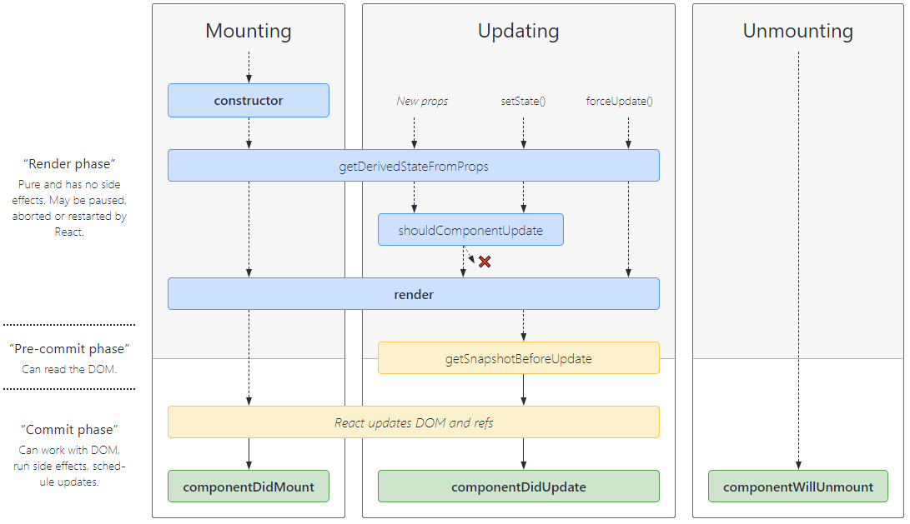

# React

## Notes

- React components should be declared with a starting capital letter (PascalCase)

## ReactDOM

This line tells React to render the App component into the DOM (element with id "root")
```js
ReactDOM.render(<App />, document.getElementById("root"));
```

## JSX

- JSX is an HTML-like syntax that is "transpiled" (converted) into JavaScript so a browser is able to process it
- all attributes in JSX are written in camelCase
- you can't use some JavaScript protected words as html attributes anymore, such as:
    - `class` - use `className`
    - `onchange` - use `onChange`
    - `for` - `htmlFor`
- When returning multiple elements, they need to be wrapped in a single parent element
    - to do this without adding extra nodes, use `<></>` (shorthand for `<React.Fragment></React.Fragement>`)
- JSX Prevents Injection Attacks
    - React DOM escapes values embedded in JSX before rendering
- Babel compiles JSX down to `React.createElement()` calls
    - `React.createElement()` performs checks and creates an object with properties such as `props`, `type` etc
    - these are the same:
    ```js
    const element = (
        <h1 className="greeting">
            Hello, world!
        </h1>
    );

    const element = React.createElement(
        'h1',
        {className: 'greeting'},
        'Hello, world!'
    );
    ```

## Elements

- React elements are immutable
- React Only Updates What’s Necessary
    - It compares element and its children to the previous one, and only applies DOM updates necessary to bring DOM to the desired state

## Components

- A good rule of thumb is that if a part of your UI is used serveral times, or is complex enough on its own, extract it to a separate component
- props are read-only (must never modify)

## State

- state should be treated as immutable (do not change it directly without using `setState` or a hook)

## Differences between functional and class components

Functional components:
- Don't require import and extend “Component” from React
- Don't need a constructor
- Don't need the render function, instead the return statement is at the end of function body
- Cannot use methods such as `setState()`, instead use hooks 
- `props` as passed in as an argument to the function instead of to a `constructor`

# Lifecycle

- A component's lifecycle is the sequence of stages an instance of a component goes through in the DOM (Virtual DOM in React's case)



## Render

- the only required method in a class component
- Contains all the logic your component should display on screen
- return `null` if nothing should be shown (Conditional rendering)
- Happenings during **moutning** and **updating** of your component
- Has to be pure with no side effects

## ComponentDidMount

- Run when the component has been mounted (when it is inserted in the DOM tree)
- Common tasks done in this method:
	- Connect to web APIs or JS frameworks
	- Set Timers (SetTimeout or SetInterval etc)
	- Add event listeners

## ComponentDidUpdate

- Invoked as soon as the updating happens
- Not called for the initial render, but called any other time when the component updates
- Useful for e.g. network requests

## ComponentWillUnmount

- Called when the component is removed from DOM tree
- Usually would do cleanup tasks in this methods (cleaning up what was adding during componentDidMount)
- e.g. 
	- Remove event listeners
	- Cancelling network requests
	- Other Cleanup routines

# Hooks

- Hooks allow functional components to also have a lifecycle as well as state

## useState

- makes it possible to declare a state in functinal components
```js
const [state, setState] = useState(initialState);
```
- when the component *first renders* and invokes `useState`, the `initialState` is the returned state from `useState`
- to update state, `setState` should be invoked with a new state value `setState(newValue)`
- setting the state is an asynchronous task, and doing so queues up a new re-render
- `useState` guarantees the state value will always be the most recent after applying updates
- the `setState` function reference never changes during re-renders
	- important as this makes it possible to have the updater function in the dependency list of other hooks such as `useEffect` or `useCallback`
```js
useEffect(() => {
  setState(5)},   
[setState]) //setState doesn't change, so useEffect is only called on mount.
```
-  if the updater function returns the exact same value as the current state, the subsequent re-render is skipped

### Functional updates

- the updater function can be invoked in 2 ways
	- passing a new value directly as an argument
	- functional updates
```js
setState((prevStateValue) => newValue)
```
- cases where this is preferred:
	- new state value depends on the previous state value (e.g. computation)
		- since `setState` is async, React guarantees that the previous state value is accurate
	- Merging object state
		- the updater function does not merge objects, unlike the `setState` function in class components. It replaces the state value with the new value
		- can use spread operator in a functional update if we want to do this
	```js
	const [state, setState] = useState({ name: "React" });  
	const updateState = () =>  setState((prevState) => ({ ...prevState, creator: "Facebook" }));
	```
	- Avoid state dependency in other hooks
		- to prevent needless fires from hooks such as `useEffect`
	```js
	// before
	useEffect(() => { setState(state * 10) },[state, setState]) // add dependencies to prevent eslint warning

	// after: if your goal is to run the callback only on mount 
	useEffect(() => { setState(prevState => prevState * 10) }, [setState]) // remove state dependency. setState can be safely used here.
	```
### Lazily initialising state

- The `initialState` argument to `useState` is only used during your initial render
- Could also pass a function which will be invoked only on initial render

### Bailing out of state update

- If you try update state with same value as current state, React won't render the component children or fire effects (e.g. `useEffect`)
- React compares the previous and current state using `Object.is` comparison algorithm
- In some cases, `React` may still render the specific component whose state was updated, but it won't render the components children again if those states have not changed
- If expensive calcualtions are done within the body of functional component, consider using `useMemo`

## useEffect

- Does the job of `componentDidMount`, `componentDidUpdate` and `componentWillUnmount` (so any side-effects)
- Syntax is: `useEffect(() => {}, [])`
- function passed to `useEffect` is invoked after the render is commited to the screen

### Conditionally firing an effect - Dependency array

- Dependency array is the 2nd argument passed to `useEffect` and is optional
- A dependency array is any state, prop, context that is used within the `useEffect` callback
	- if your effect depends on any state or prop value in the scope, be sure to pass it as a dependency to prevent stale values being accessed within the callback
- `useEffect` will trigger based on changes in the dependencies listed
	- we can also include state or props that are not used in the callback
- If we leave the dependency array empty, then it will work like a `componentDidMount` lifecycle method - the hook runs one time when the component mounts
- If we add a dependency, then the `useEffect` hook will re-run any time that dependency changes. Similar to `componentDidUpdate` with the only difference being it only runs when a certain condition has changed
- If we leave out the dependency array, the `useEffect` hook runs anytime the component is updated **AND** right after the initial render. This would be equal to a `componentDidMount` and `componentDidUpdate` method combined.

- recommended to use `eslint-plugin-react-hooks` package as it warns when dependencies are specified incorrectly

### Cleanup

- the return statement added to the callback of `useEffect` is equal to a `componentWillUnmount` method (so do any subscription cleanups here)
	- the cleanup function is guaranteed to be invoked before the component is removed from the user interface

### Timing of effect

- The effect callback is invoked after the browser layout and painting are carried out
	- it is deferred until the browser has painted, but it still guaranteed to be fired before any re-renders (React will always flush a previous render’s effect before starting a new update)
	- This makes it suitable for many common side effects such as setting up subscriptions and event handlers (these won't block the browser from updating the screen)
- This behaviour may not always be ideal however, so there is another hook `useLayoutEffect` - it is similar to `useEffect` but is fired synchronously after all DOM mutations (before the browser has a chance to paint)
	- `useEffect` is preferred when possible to avoid blocking visual updates

### Example

```js
useEffect(() => {
	const changeColorOnClick = () => {
		if (color === "black") {
			setColor("red");
		} else {
			setColor("black");
		}
	};

	document.addEventListener("click", changeColorOnClick);

	return () => {
		document.removeEventListener("click", changeColorOnClick);
	};
}, [color]);
```

## useReducer

- alternative to `useState`
```js
const [state, dispatch] = useReducer(reducer, initialArgument, init);
```
- when invoked, it returns an array that holds the current `state`, and a `dispatch` method
- the `dispatch` function is invoked by passing it an `action` (object)
```js
dispatch({type: 'increase', payload: 10})
```

### When to use

- When you have complex state logic that utilises multiple sub-values, or when a state depends on  a previous one

### reducer function

- the first argument accepted, `reducer`, is a function of type `(state, action) => newState`
- it takes in the current `state` and an `action` object and returns a new state value
- a common approach:
```js
const reducer = (state, action) => {
	// check action type  
	switch (action.type) {
		case "increase":
			//return new state
			return state * 10;
		default:
			return state;
	}
}
```

### Initial state and lazy initialisation

- if there is no third argument, the second argument wil lbe taken as the `initialState` for the hook
- To create the initial state lazily, pass a third argument: `init` function
	- doing this will have the initial state set to `init(initialState)` (function will be invoked with second argument)
	- this allows you to extract the logic for calculating state outside the reducer, and maybe handy for resetting state later

```js
function init(someInitialValue) {
   return { state: someInitialValue };
}


function reducer(state, action) {
   switch(action.type) {
      case 'reset': 
			return init(action.payload); // an action object typically has a "type" and a "payload" 
   }
}
...
const initialValue = 10;
const [state, dispatch] = useReducer(reducer, initialValue, init);
```

### Bailing out of a dispatch

- if we try updating state with same value as current, React won't render the component children or fire effects. Other points are similar to `useState`

## useContext

## useCallback

## useMemo

## useRef

```js
const refObject = useRef(initialValue)
```
- `useRef` returns a mutable object whose value is set as: `{current: initialValue}`
- the ref object remains the same all through the lifetime of the component (across re-renders)
	- this is not the case with a regular object
- e.g. 
```js
const App = ({prop1}) => {
	const initialProp1 = useRef(prop1); // save props1 in ref object on render
	useEffect(() => {
		// see values logged here
		console.log({ initialProp1: initialProp1.current, prop1 });
	}, [prop1]);
};

// Initialise to 2
<App prop1={2} />
// log will be { initialProp1: 2, prop1: 2 }

// if prop1 passed to was changed to 3 later on
<App prop1={3} />
// log will be { initialProp1: 2, prop1: 3 } - initialProp1 remains the same as it is saved in the ref object.
```
- The only was to update the ref value is by mutating the `current` property
```js
// initialProp1.current = *new value*
```
- Note `useRef` does not notify for when its content changes (mutating current property does not cause a re-render)

### Example
- a common use case for `useRef` is to store child DOM nodes
```js
function TextInputWithFocusButton() {
  //1. create a ref object with initialValue of null
  const inputEl = useRef(null);

  const onButtonClick = () => {
    // 4. `current` points to the mounted text input element
    // 5. Invoke the imperative focus method from the current property
    inputEl.current.focus();
  };

  return (
    <>
      {/* 2. as soon as input is rendered, the element will be saved in the ref object i.e {current: *dom node*}  */}
      <input ref={inputEl} type="text" />
      {/* 3. clicking the button invokes the onButtonClick handler above */}
      <button onClick={onButtonClick}>Focus the input</button>
    </>
  );
} 
```
- this works since passing a `ref` object (e.g. `<div ref={myRef}/>`) will set its current property to the corresponding DOM node whenever that node changes (i.e. `myRef = {current: *dom node*}`)

## useImperativeHandle

## useLayoutEffect

## useDebugValue

# Create-react-app

- sets up a complete React application for you
```
npx create-react-app my-first-react-app

cd my-first-react-app

npm start
```

## File structure

- `./node_modules` for packages
- `./public` folder 
    - `index.html` - template for generating `build/index.html` (the main file that gets served on browser)
    - `manifest.json` - web app manifest that describes your application. Used by e.g. mobile phones if shortcut is added to home screen (contains things like `favicon.ico` icon image file)
- `package.json` - for package dependencies and scripts etc
- `package-lock.json` - stores versions installed for package dependencies
- by default `index.js` is the entry point and `App.js` is the main application component

# Links

Great article about hooks: https://blog.ohansemmanuel.com/react-hooks-documentation-easy-to-read/